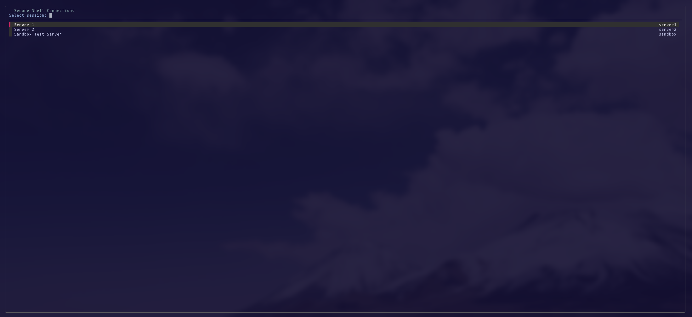
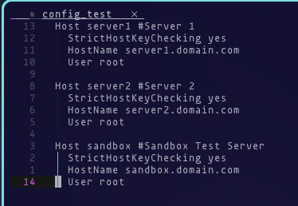

## XXH (SSH Quick Session Access for TMUX)

XXH scrubs your $HOME/.ssh directory for any config files (filename must begin with config) and adds hosts found there to the list of connectable hosts. It then presents a list of hosts and "pretty" names via fzf. Selecting a host(s) will open a session to that host in a new tmux window. Alternatively run with the -s flag to open in a tmux pane in the current window.

I made XXH specifically for use with tmux but it's trivial to modify for use with terminal emulators, launching the SSH session in new tabs or splits. 

## SSH Host Defnitions

In your ssh config files add a # sign on the 'Host' line then anything after the # will be applied to that host as a descriptive name. Any host that doesn't have a "pretty" name will not be added to the list. Note: Probably something I should fix....

## Caching

XXH caches the list it creates on first run and on subsequent runs it checks the .ssh directory for changes. If changes are found there will be a slight delay in launching the FZF window while it regenerates the list. 

### Credits
Some code (specifically the list) and major inspiration drawn from 'sshto' - https://github.com/vaniacer/sshto
